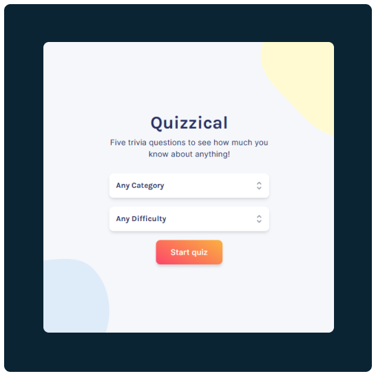

# <div align="center"><center>[Quizzical](https://quizzical-ten.vercel.app/)</div>
Multiple choice trivia with a variety of categories and difficulty settings.

## 🏃 Motivation & Challenges
This project was created to practice using React alongside an API (OpenTriviaDB) and component library (HeadlessUI).

#### Configuring the API request:
```javascript
// handling state for the categories/difficulties
const [selectedDifficulty, setSelectedDifficulty] = useState(difficulties[0]);
const [selectedCategory, setSelectedCategory] = useState(categories[0]);

// API requests parameters
async function getQuestions(category, difficulty) {
  const res = await fetch(
    `https://opentdb.com/api.php?amount=5&category=${category}&difficulty=${difficulty}&type=multiple`
    );
  ...
}

// functions to get the parameters
// each category has an id that is assigned to the value attribute based on the dropdown option
function getCategory() {
  const category = document
    .querySelector("#category")
    .getAttribute("value");

  return category;
}

function getDifficulty() {
  const difficulty = document.querySelector("#difficulty").innerText;

  let updatedDifficulty;
  if (difficulty === "Any Difficulty") {
    return "";
  } else {
    updatedDifficulty = difficulty.toLowerCase();
  }
  return updatedDifficulty;
}

// function which handles click on start quiz button and sets the state to value of the functions
function handleStartQuiz() {
  setSelectedCategory(getCategory());
  setSelectedDifficulty(getDifficulty());
}

```

## 🚧 To Do
- [ ] Confetti if all answers correct
- [ ] Allow selection if another answer selected

Preview
---

